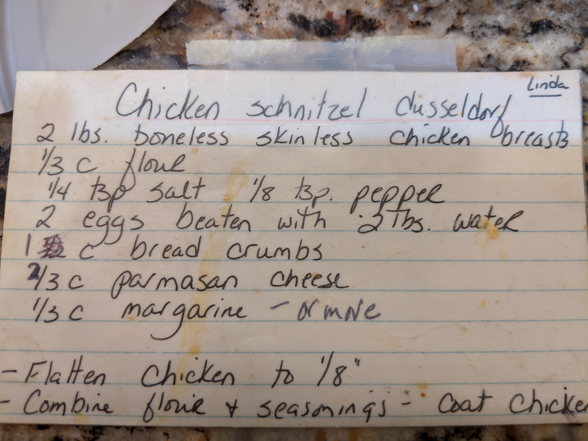
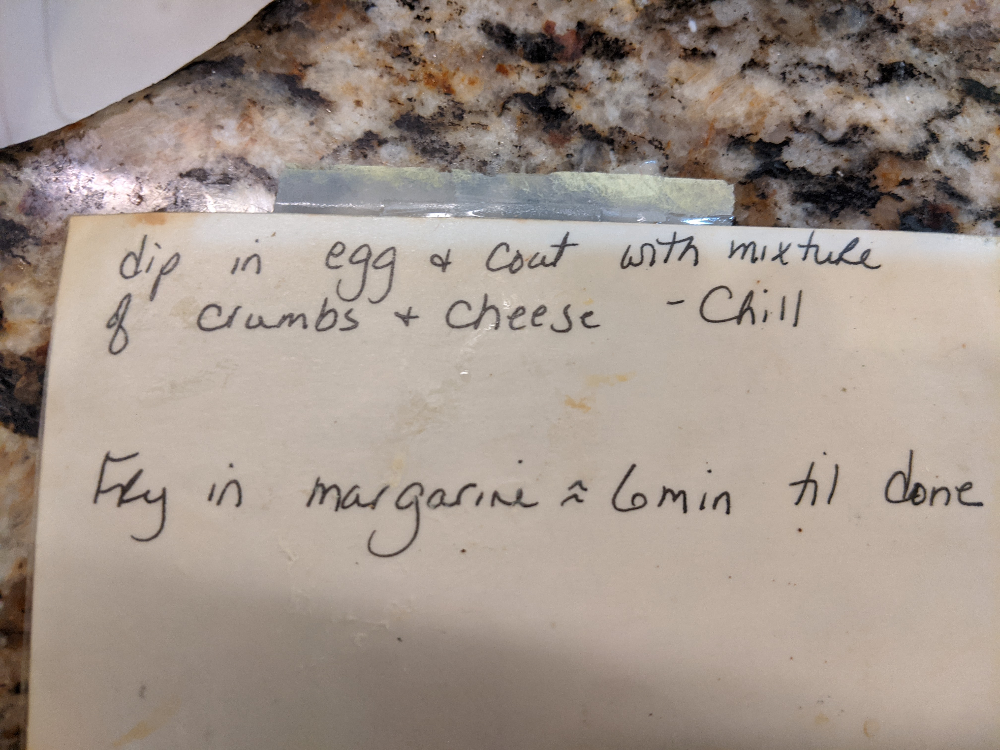

Chicken Schnitzel Dusseldorf  (from Aunt Linda)
===============================================
- 2 lbs boneless skinless chicken breasts
- 1/3 c flour
- 1/4 tsp salt
- 1/8 tsp pepper
- 2 eggs beaten with 2 Tbs water
- 1 c (updated from 1/2) bread crumbs
- 2/3 c (updated from 1/3) parmesan cheese
- 1/3 c margarine(sic) -or more

1. Flatten chicken to 1/8"
2. Combine flour & seasonings - coat chicken dip in egg and coat with mixture of crumbs and cheese
3. Chill
4. Fry in margarine ~6min till done

Original Recipe
===============

