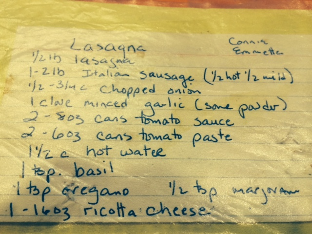
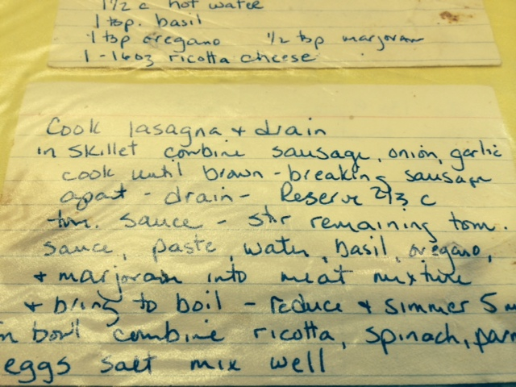
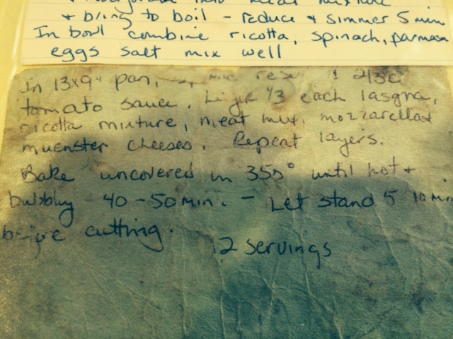

Mom's Lasagna
========================
12 servings

Ingredients
-----------
* 1/2 lb lasagna
* 1-2 lb Italian Sausage (hot/mild mix)
* 1 medium white onion
* 1 clove minced garlic
* 2 8oz cans tomato sauce
* 2 6oz cans tomato paste
* 1 tsp basil
* 1 tsp oregano
* 1/2 tsp marjoram
* 12oz chopped spinach
* 16oz ricotta cheese  (TODO: bump this up if actually doing 3 layers)
* 16oz (4c) shredded Mozzarella (original recipe actually says 2, but, cheese.)
* 16oz (4c) shredded Muenster (2, but, cheese.)
* 1/2c Grated Parmesan
* 3 eggs
* 1/2 tsp salt

Steps
-----
1. Cook lasagna and drain
2. In a skillet, combine (with casing removed) sausage, diced onion, garlic and cook (breaking sausage apart) until brown, then drain.
3. Set aside 2/3c tomato sauce
4. Add remaining remaining tomato sauce, tomato paste, 1.5c hot water, basil, oregano, and marjoram into skillet.  Bring back to a boil, then reduce & simmer for 5 minutes.
5. In a bowl combine the ricotta, spinach, parmesan, eggs, and salt.  Mix well.
6. In a 13x9" pan, spread the reserved 2/3c tomato sauce.
7. Layer 1/3 each lasagna, ricotta mixture, meat mixture, mozarella + muenster cheeses.  Repeat layers x3.
8. Bake uncovered at 350 until hot and bubbling (40-50min).  Let stand 5-10m before cutting.

Original Recipe
===============

